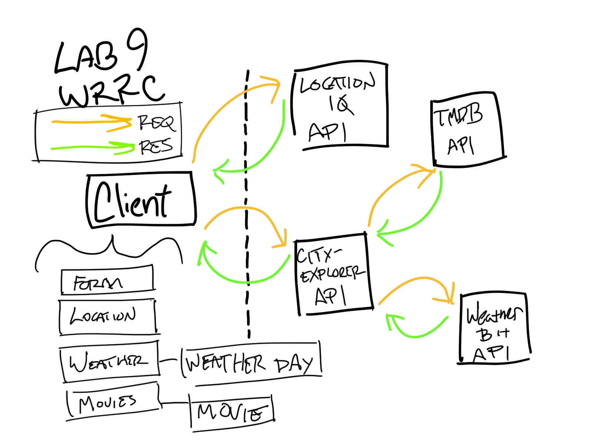

# City Explorer API

**Author**: Micha Davis
**Version**: 1.3.0 (increment the patch/fix version number if you make more commits past your first submission)

## Overview
This server stores and retrieves data for the [City Explorer](https://github.com/Micha-L-Davis/city-explorer) app.

## Getting Started
Data queries can be made in the app. There is no need to request data directly from this server.

## Architecture
Express, Cors, Dotenv, JavaScript

## Change Log
Name of feature: #1 - Set up server repository

Estimate of time needed to complete: 15min

Start time: 2/22/2022 @2:12

Finish time: 2/22/2022 @2:30

Actual time needed to complete: 18min

---

Name of feature: #2 - Weather placeholder data

Estimate of time needed to complete: 1hr

Start time: 2/22/2022 @2:45

Finish time: 2/22/2022 @4:15

Actual time needed to complete: 90min

---

Name of feature: #3 - Error handling

Estimate of time needed to complete: 45min

Start time: 2/22/2022 @4:15

Finish time: 2/22/2022 @5:15

Actual time needed to complete: 60min

---

Name of feature: #4 - Live Weather

Estimate of time needed to complete: 45min

Start time: 2/23/2022 @3:05pm

Finish time: 2/23/2022 @3:50pm

Actual time needed to complete: 45min

---

Name of feature: #5 - Movies

Estimate of time needed to complete: 45min

Start time: 2/23/2022 @4:30

Finish time: 2/23/2022 @8:45 (lots of interruptions throughout this part)

Actual time needed to complete: Unknown (rought estimate 60min

---

Name of feature: #6 - Modularize back-end codebase

Estimate of time needed to complete: 15min

Start time: 2/24/2022 @1:45

Finish time: 2/24/2022 @2:00

Actual time needed to complete: 60min

## Credit and Collaborations
* [The Movie Database](https://themoviedb.org)
* [Weatherbit](https://weatherbit.io)
* Collab with Rey Mercado, Michael Campbell, Matt Rangel on WRRC diagram
