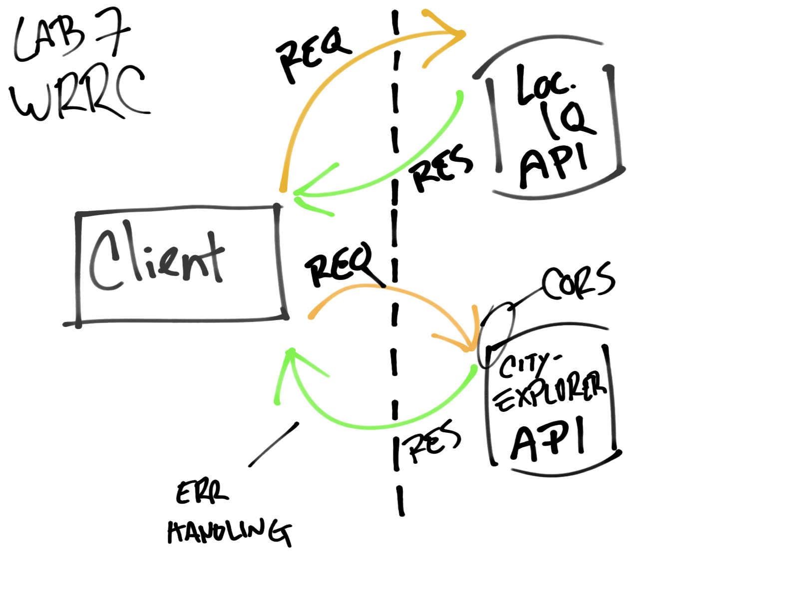

# City Explorer API

**Author**: Micha Davis
**Version**: 1.0.0 (increment the patch/fix version number if you make more commits past your first submission)

## Overview
This server stores and retrieves data for the [City Explorer](https://github.com/Micha-L-Davis/city-explorer) app.

## Getting Started
Data queries can be made in the app. There is no need to request data directly from this server.

## Architecture
Express, Cors, Dotenv, JavaScript

## Change Log
Name of feature: #1 - Set up server repository

Estimate of time needed to complete: 15min

Start time: 2/22/2022 @2:12

Finish time: 2/22/2022 @2:30

Actual time needed to complete: 18min

---

Name of feature: #2 - Weather placeholder data

Estimate of time needed to complete: _____

Start time: _____

Finish time: _____

Actual time needed to complete: _____

---

Name of feature: #3 - Error handling

Estimate of time needed to complete: _____

Start time: _____

Finish time: _____

Actual time needed to complete: _____

## Credit and Collaborations
<!-- Give credit (and a link) to other people or resources that helped you build this application. -->